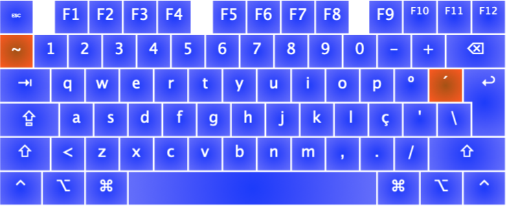
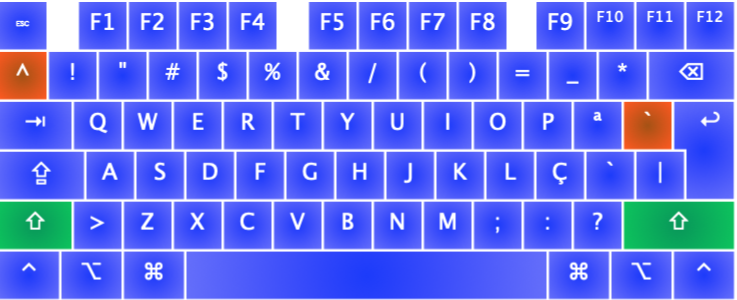
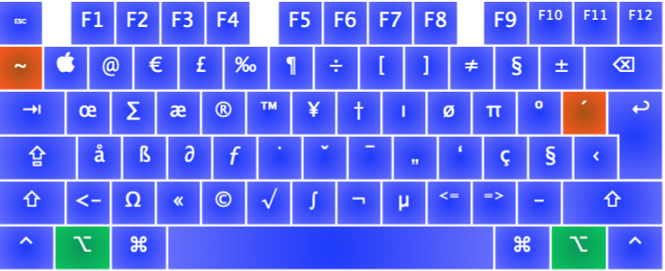
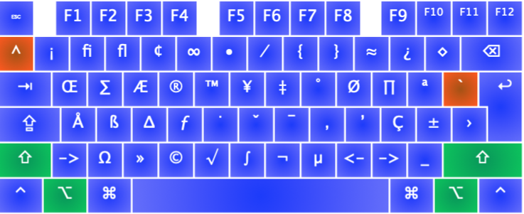
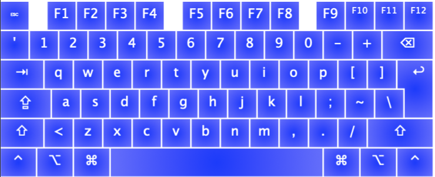
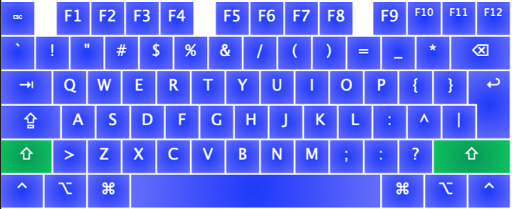

# Keyboard layouts

I base my 2 layouts on Portuguese Mac layout for both Windows and MacOS.

## PT+

PT (Mac) layout to be able to write portguese with a couple changes motivated by the US / UK layouts:

- `'` `?` -> `-` `_`
- `-` `_` -> `/` `?`
- `~` `^` -> `'` `` ` ``
- `§` `±` -> `~` `^`

The  `´` `` ` `` and `~` `^` keys keep the *dead keys* behaviour as expected.

## PT-Dev

Everything that PT+ does, removes all dead keys, and replaces some keys not used during programing motivated by UK / US layouts.

- `º` `ª` -> `[` `{`
- `´` `` ` `` -> `]` `}`
- `ç` `Ç` -> `;` `:`

Pressing `Alt` or `Alt` + `Shift` makes the keyboard behave as PT+ (also enables the removed *dead keys*).

- `Alt` +  `º` `ª` -> `º` `ª`
- `Alt` + `´` `` ` `` -> `´` `` ` ``
- `Alt` + `ç` `Ç` -> `ç` `Ç`
